# Diagram sekwencji autentykacji - AdoptMe

## Przepływ autentykacji w aplikacji

Poniższy diagram przedstawia szczegółowy przepływ autentykacji w aplikacji AdoptMe,
uwzględniający komunikację między przeglądarką, middleware Astro, API endpoints oraz Supabase Auth.

```mermaid
sequenceDiagram
    autonumber

    participant B as Przeglądarka
    participant M as Middleware Astro
    participant API as Astro API
    participant SA as Supabase Auth
    participant DB as Baza Danych

    Note over B,DB: Scenariusz 1: Rejestracja nowego użytkownika

    B->>API: POST /api/v1/auth/register
    Note right of B: Email, hasło, zgoda RODO
    activate API
    API->>API: Walidacja danych (Zod)
    API->>SA: signUp(email, password)
    activate SA
    SA->>DB: Utworzenie użytkownika w auth.users
    DB-->>SA: OK
    SA->>SA: Generowanie tokena weryfikacyjnego
    SA->>B: Wysłanie e-maila weryfikacyjnego
    SA-->>API: Sukces rejestracji
    deactivate SA
    API-->>B: 201 Created
    deactivate API

    Note over B: Użytkownik klika link w e-mailu

    B->>M: GET /auth/verify-email?token=xxx
    activate M
    M->>SA: verifyOtp(token)
    activate SA
    SA->>DB: Aktualizacja email_confirmed_at
    SA-->>M: Token zweryfikowany
    deactivate SA
    M-->>B: Przekierowanie do /auth/login
    deactivate M

    Note over B,DB: Scenariusz 2: Logowanie użytkownika

    B->>API: POST /api/v1/auth/login
    Note right of B: Email, hasło
    activate API
    API->>API: Walidacja danych (Zod)
    API->>SA: signInWithPassword(email, password)
    activate SA
    SA->>DB: Weryfikacja credentials
    alt Email niezweryfikowany
        SA-->>API: Email not confirmed
        API-->>B: 401 Email not verified
    else Credentials poprawne
        SA->>SA: Generowanie access_token i refresh_token
        SA-->>API: Session + User data
        deactivate SA
        API->>DB: Pobranie danych z tabeli users
        activate DB
        DB-->>API: UserResponse (id, email, role, shelter_id)
        deactivate DB
        API->>API: Ustawienie cookies (HttpOnly, Secure)
        Note right of API: sb-access-token (1h)<br/>sb-refresh-token (30d)
        API-->>B: 200 OK + User data
        deactivate API
        B->>B: Redirect do strony głównej
    end

    Note over B,DB: Scenariusz 3: Request do chronionej strony

    B->>M: GET /dogs/123/adopt
    activate M
    M->>M: Odczyt cookies (access_token)

    alt Token ważny
        M->>SA: getUser(access_token)
        activate SA
        SA-->>M: Auth User data
        deactivate SA
        M->>DB: SELECT * FROM users WHERE id
        activate DB
        DB-->>M: User details (role, shelter_id)
        deactivate DB
        M->>M: Zapisanie w Astro.locals.user
        M->>B: Renderowanie strony z danymi użytkownika
        Note right of B: User przekazany jako props<br/>do komponentów React
    else Token wygasły
        M->>SA: refreshSession(refresh_token)
        activate SA
        SA->>SA: Walidacja refresh_token
        alt Refresh token ważny
            SA->>SA: Generowanie nowych tokenów
            SA-->>M: Nowa sesja
            deactivate SA
            M->>M: Aktualizacja cookies
            M->>M: Ponowne wywołanie middleware
            M->>B: Renderowanie strony
        else Refresh token wygasły
            M-->>B: Redirect do /auth/login
            Note right of B: redirectTo parametr zapisany
        end
    end
    deactivate M

    Note over B,DB: Scenariusz 4: Odzyskiwanie hasła

    B->>API: POST /api/v1/auth/forgot-password
    Note right of B: Email
    activate API
    API->>SA: resetPasswordForEmail(email)
    activate SA
    SA->>SA: Generowanie tokena recovery
    SA->>B: Wysłanie e-maila z linkiem
    SA-->>API: E-mail wysłany
    deactivate SA
    API-->>B: 200 OK (nawet jeśli email nie istnieje)
    deactivate API

    Note over B: Użytkownik klika link w e-mailu

    B->>M: GET /auth/reset-password?token=yyy
    M-->>B: Renderowanie formularza
    B->>API: POST /api/v1/auth/reset-password
    Note right of B: Token, nowe hasło
    activate API
    API->>SA: verifyOtp(token, type: recovery)
    activate SA
    SA-->>API: Token zweryfikowany
    API->>SA: updateUser(password: new_password)
    SA->>DB: Aktualizacja hasła (hash)
    SA-->>API: Hasło zaktualizowane
    deactivate SA
    API-->>B: 200 OK
    deactivate API
    B->>B: Redirect do /auth/login

    Note over B,DB: Scenariusz 5: Wylogowanie

    B->>API: POST /api/v1/auth/logout
    activate API
    API->>SA: signOut()
    activate SA
    SA-->>API: Sesja zakończona
    deactivate SA
    API->>API: Usunięcie cookies
    API-->>B: 200 OK
    deactivate API
    B->>B: Redirect do strony głównej

    Note over B,DB: Kluczowe mechanizmy bezpieczeństwa:<br/>- Cookies HttpOnly, Secure, SameSite=Lax<br/>- RLS policies w bazie danych<br/>- Automatyczne odświeżanie tokenów<br/>- Middleware jako single source of truth
```

## Kluczowe cechy architektury

### Zalety podejścia z middleware
1. **Automatyczne zarządzanie sesjami** - każdy request sprawdza i odświeża tokeny
2. **Brak dodatkowych API calls** - dane użytkownika dostępne w `Astro.locals.user`
3. **Server-Side Rendering** - pełne dane przy pierwszym renderze
4. **Jednolite źródło prawdy** - middleware jako centralny punkt autentykacji

### Bezpieczeństwo
- Wszystkie hasła hashowane przez Supabase (bcrypt)
- Cookies z flagami HttpOnly, Secure, SameSite=Lax
- Row Level Security (RLS) na poziomie bazy danych
- Automatyczne triggery dla spójności danych
- Weryfikacja origin dla operacji POST/PUT/DELETE

### Przepływ danych
- **Server → Client**: User przekazywany jako props do React
- **Client → Server**: Formularze wysyłają dane do API endpoints
- **API → Supabase**: Wszystkie operacje auth przez Supabase Auth
- **Supabase → Database**: Automatyczna synchronizacja przez triggery

