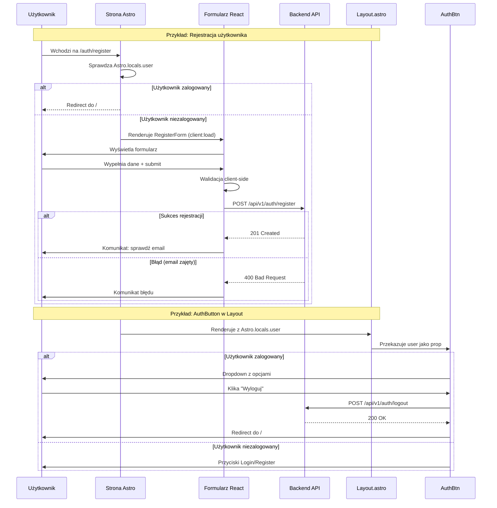

# Struktura komponentów UI autentykacji

## Diagram hierarchii komponentów

```mermaid
graph TB
    subgraph "Strony Astro (SSR)"
        Login["/auth/login.astro"]
        Register["/auth/register.astro"]
        Forgot["/auth/forgot-password.astro"]
        Reset["/auth/reset-password.astro"]
        Verify["/auth/verify-email.astro"]
        Logout["/auth/logout.astro"]
    end

    subgraph "Layout"
        Layout["Layout.astro<br/>(Header + Navigation)"]
    end

    subgraph "Komponenty React Auth"
        LoginForm["LoginForm.tsx<br/>(email + password)"]
        RegisterForm["RegisterForm.tsx<br/>(email + password + GDPR)"]
        ForgotForm["ForgotPasswordForm.tsx<br/>(email)"]
        ResetForm["ResetPasswordForm.tsx<br/>(password + confirm)"]
        AuthBtn["AuthButton.tsx<br/>(dropdown menu)"]
        Protected["ProtectedRoute.tsx<br/>(access control)"]
    end

    subgraph "Komponenty UI (Shadcn)"
        Button["Button"]
        Card["Card + Header/Content/Footer"]
        Input["Input"]
        Label["Label"]
        Checkbox["Checkbox"]
    end

    subgraph "API Endpoints (Backend)"
        API["/api/v1/auth/*<br/>(TODO)"]
    end

    %% Relacje Layout
    Layout --> AuthBtn
    Login -.wykorzystuje Layout.-> Layout
    Register -.wykorzystuje Layout.-> Layout
    Forgot -.wykorzystuje Layout.-> Layout
    Reset -.wykorzystuje Layout.-> Layout
    Verify -.wykorzystuje Layout.-> Layout

    %% Relacje Strony -> Formularze
    Login --> LoginForm
    Register --> RegisterForm
    Forgot --> ForgotForm
    Reset --> ResetForm

    %% Relacje Formularze -> UI
    LoginForm --> Button
    LoginForm --> Card
    LoginForm --> Input
    LoginForm --> Label

    RegisterForm --> Button
    RegisterForm --> Card
    RegisterForm --> Input
    RegisterForm --> Label
    RegisterForm --> Checkbox

    ForgotForm --> Button
    ForgotForm --> Card
    ForgotForm --> Input
    ForgotForm --> Label

    ResetForm --> Button
    ResetForm --> Card
    ResetForm --> Input
    ResetForm --> Label

    AuthBtn --> Button

    %% Relacje z API
    LoginForm -.POST request.-> API
    RegisterForm -.POST request.-> API
    ForgotForm -.POST request.-> API
    ResetForm -.POST request.-> API
    AuthBtn -.POST logout.-> API

    %% Style
    classDef astroPage fill:#7c3aed,stroke:#5b21b6,color:#fff
    classDef reactComp fill:#3b82f6,stroke:#1d4ed8,color:#fff
    classDef uiComp fill:#10b981,stroke:#059669,color:#fff
    classDef api fill:#f59e0b,stroke:#d97706,color:#fff
    classDef layout fill:#ec4899,stroke:#be185d,color:#fff

    class Login,Register,Forgot,Reset,Verify,Logout astroPage
    class LoginForm,RegisterForm,ForgotForm,ResetForm,AuthBtn,Protected reactComp
    class Button,Card,Input,Label,Checkbox uiComp
    class API api
    class Layout layout
```

## Przepływ danych



## Zależności między komponentami

### 1. Komponenty UI (Shadcn) - Warstwa podstawowa
```
button.tsx
  └─ używa: cva, @radix-ui/react-slot

card.tsx
  └─ używa: podstawowe HTML

input.tsx
  └─ używa: podstawowe HTML

label.tsx
  └─ używa: @radix-ui/react-label

checkbox.tsx
  └─ używa: @radix-ui/react-checkbox, lucide-react
```

### 2. Formularze React - Warstwa logiki
```
LoginForm.tsx
  ├─ używa: Button, Card, Input, Label
  └─ zależności: useState, FormEvent

RegisterForm.tsx
  ├─ używa: Button, Card, Input, Label, Checkbox
  └─ zależności: useState, FormEvent

ForgotPasswordForm.tsx
  ├─ używa: Button, Card, Input, Label
  └─ zależności: useState, FormEvent

ResetPasswordForm.tsx
  ├─ używa: Button, Card, Input, Label
  ├─ props: token (string)
  └─ zależności: useState, FormEvent

AuthButton.tsx
  ├─ używa: Button
  ├─ props: user (DTO.UserResponse | null), variant
  └─ zależności: useState, DTO types

ProtectedRoute.tsx
  ├─ props: user, requiredRole?, fallback?, children
  └─ zależności: ReactNode, DTO types
```

### 3. Strony Astro - Warstwa SSR
```
login.astro
  ├─ importuje: Layout, LoginForm
  ├─ używa: Astro.locals.user, Astro.url.searchParams
  └─ logika: redirect jeśli zalogowany

register.astro
  ├─ importuje: Layout, RegisterForm
  ├─ używa: Astro.locals.user
  └─ logika: redirect jeśli zalogowany

forgot-password.astro
  ├─ importuje: Layout, ForgotPasswordForm
  └─ logika: brak sprawdzenia sesji

reset-password.astro
  ├─ importuje: Layout, ResetPasswordForm, Card, Button
  ├─ używa: Astro.url.searchParams
  └─ logika: walidacja tokena z URL

verify-email.astro
  ├─ importuje: Layout, Card, Button
  ├─ używa: Astro.url.searchParams
  └─ logika: weryfikacja tokena (TODO: integracja z API)

logout.astro
  └─ logika: redirect do / z message
```

### 4. Layout - Warstwa nadrzędna
```
Layout.astro
  ├─ importuje: AuthButton
  ├─ używa: Astro.locals.user
  └─ struktura: <header> + <main><slot/></main>
```

## Wzorce użycia

### Pattern 1: Formularz z API call
```tsx
const [isLoading, setIsLoading] = useState(false);
const [error, setError] = useState<string | null>(null);

const handleSubmit = async (e: FormEvent) => {
  e.preventDefault();
  setIsLoading(true);
  setError(null);

  try {
    const response = await fetch('/api/v1/auth/endpoint', {
      method: 'POST',
      body: JSON.stringify(data)
    });

    if (!response.ok) {
      const { error } = await response.json();
      throw new Error(error);
    }

    // Success handling
  } catch (err) {
    setError(err.message);
  } finally {
    setIsLoading(false);
  }
};
```

### Pattern 2: Conditional rendering w Astro
```astro
---
const user = Astro.locals.user;
if (user) {
  return Astro.redirect('/');
}
---
<Layout>
  <FormComponent client:load />
</Layout>
```

### Pattern 3: AuthButton dropdown
```tsx
const [showDropdown, setShowDropdown] = useState(false);

// Backdrop do zamykania dropdown
<div onClick={() => setShowDropdown(false)} />

// Menu z opcjami per rola
{user.role === 'adopter' && <AdopterMenu />}
{user.role === 'shelter_staff' && <ShelterMenu />}
```

---

**Legenda kolorów diagramu:**
- 🟣 Fioletowy - Strony Astro (SSR)
- 🔵 Niebieski - Komponenty React (Client-side)
- 🟢 Zielony - Komponenty UI (Shadcn)
- 🟠 Pomarańczowy - API Backend (TODO)
- 🌸 Różowy - Layout (Struktura nadrzędna)

