# Diagram architektury UI - AdoptMe

## Struktura komponentów i przepływ danych

Poniższy diagram przedstawia pełną architekturę interfejsu użytkownika aplikacji AdoptMe,
uwzględniając strony Astro, komponenty React, API endpoints oraz przepływ danych.

```mermaid
flowchart TD
    subgraph "Warstwa Middleware"
        MW[Middleware Astro]
        MW --> |Sprawdza cookies sesji| MW
        MW --> |Odświeża tokeny| MW
        MW --> |Wypełnia Astro.locals.user| MW
    end

    subgraph "Warstwa Layouts"
        LO[Layout.astro]
        LO --> |Przekazuje user| AB
        AB[AuthButton React]
        AB --> |Niezalogowany| BL[Przyciski Login/Register]
        AB --> |Zalogowany| UM[User Menu + Dropdown]
    end

    subgraph "Strony Publiczne Astro"
        PH[index.astro Strona Główna]
        DC[dogs/index.astro Katalog]
        DD[dogs/id/index.astro Szczegóły]

        PH --> |Przekazuje user jako props| MA[MainApp React]
        MA --> |Inicjalizuje| AS[Auth Store Zustand]
    end

    subgraph "Strony Autentykacji Astro"
        AL[auth/login.astro]
        AR[auth/register.astro]
        AFP[auth/forgot-password.astro]
        ARP[auth/reset-password.astro]
        AVE[auth/verify-email.astro]
        ALO[auth/logout.astro]

        AL --> |redirectIfAuthenticated| AL
        AR --> |redirectIfAuthenticated| AR

        AL --> |Osadza komponent| LF[LoginForm React]
        AR --> |Osadza komponent| RF[RegisterForm React]
        AFP --> |Osadza komponent| FPF[ForgotPasswordForm React]
        ARP --> |Osadza komponent| RPF[ResetPasswordForm React]
    end

    subgraph "Strony Chronione Astro"
        DA[dogs/id/adopt.astro]
        UP[profile/index.astro]
        SD[shelter/dashboard.astro]

        DA --> |requireAuth| DA
        UP --> |requireAuth| UP
        SD --> |requireRole shelter_staff| SD

        DA --> |Osadza| AF[AdoptionForm React]
        UP --> |Osadza| PF[ProfileForm React]
        SD --> |Osadza| SL[ShelterList React]
    end

    subgraph "Komponenty React Formularzy"
        LF --> |Walidacja client-side| LF
        RF --> |Walidacja client-side| RF
        FPF --> |Walidacja client-side| FPF
        RPF --> |Walidacja client-side| RPF

        LF --> |POST request| APIL[API login]
        RF --> |POST request| APIR[API register]
        FPF --> |POST request| APIFP[API forgot-password]
        RPF --> |POST request| APIRP[API reset-password]
    end

    subgraph "API Endpoints"
        APIL[api/v1/auth/login.ts]
        APIR[api/v1/auth/register.ts]
        APILO[api/v1/auth/logout.ts]
        APIFP[api/v1/auth/forgot-password.ts]
        APIRP[api/v1/auth/reset-password.ts]

        APIL --> |Walidacja Zod| ZV[Zod Validators]
        APIR --> |Walidacja Zod| ZV
        APIFP --> |Walidacja Zod| ZV
        APIRP --> |Walidacja Zod| ZV

        APIL --> |Wywołuje| AUTHSVC[AuthService]
        APIR --> |Wywołuje| AUTHSVC
        APILO --> |Wywołuje| AUTHSVC
        APIFP --> |Wywołuje| AUTHSVC
        APIRP --> |Wywołuje| AUTHSVC
    end

    subgraph "Warstwa Serwisów"
        AUTHSVC --> |Komunikacja| SPA[Supabase Auth]
        AUTHSVC --> |Operacje na| DB[(Database users)]

        AG[Auth Guards]
        AG --> |requireAuth| AG
        AG --> |requireRole| AG
        AG --> |redirectIfAuthenticated| AG
    end

    subgraph "Zarządzanie Stanem"
        AS --> |Stan globalny| AS
        AS --> |useAuthStore hook| MA
        AS --> |useAuthStore hook| AB
        AS --> |logout action| APILO
    end

    subgraph "Komponenty Pomocnicze"
        PR[ProtectedRoute React]
        PR --> |Sprawdza auth| PR
        PR --> |Fallback/Redirect| PR
    end

    MW ==> |Dla każdego requesta| LO
    MW ==> |Dla każdego requesta| PH
    MW ==> |Dla każdego requesta| AL
    MW ==> |Dla każdego requesta| DA

    LF -.-> |Success redirect| PH
    RF -.-> |Success message| AR

    UM --> |Kliknięcie Wyloguj| APILO
    APILO -.-> |Redirect| PH

    BL --> |Kliknięcie Login| AL
    BL --> |Kliknięcie Register| AR

    DC --> DD
    DD --> |Próba adopcji niezalogowany| AL
    DD --> |Próba adopcji zalogowany| DA

    AUTHSVC --> |Ustawia cookies| APIL
    AUTHSVC --> |Usuwa cookies| APILO

    style MW fill:#e1f5ff
    style AS fill:#fff4e1
    style AUTHSVC fill:#ffe1f5
    style AG fill:#ffe1f5
    style SPA fill:#e1ffe1
    style DB fill:#e1ffe1

    classDef astroPage fill:#b3d9ff,stroke:#0066cc,stroke-width:2px
    classDef reactComp fill:#ffccb3,stroke:#cc6600,stroke-width:2px
    classDef apiEndpoint fill:#d9b3ff,stroke:#6600cc,stroke-width:2px
    classDef service fill:#ffb3d9,stroke:#cc0066,stroke-width:2px

    class PH,DC,DD,AL,AR,AFP,ARP,AVE,ALO,DA,UP,SD,LO astroPage
    class LF,RF,FPF,RPF,AB,MA,AF,PF,SL,PR reactComp
    class APIL,APIR,APILO,APIFP,APIRP apiEndpoint
    class AUTHSVC,AG,ZV service
```



## Legenda kolorów

- 🔵 **Niebieski** - Strony Astro (SSR)
- 🟠 **Pomarańczowy** - Komponenty React (Client-Side)
- 🟣 **Fioletowy** - API Endpoints
- 🔴 **Różowy** - Serwisy i helpery
- 🟢 **Zielony** - Zewnętrzne zależności (Supabase, Database)
- ⚪ **Jasnoniebieski** - Middleware (punkt wejścia)
- ⚪ **Jasnożółty** - Zarządzanie stanem (Zustand)

## Przepływ danych

### 1. Request Lifecycle
```
Request → Middleware → Sprawdzenie sesji → Astro.locals.user
→ Strona Astro → Przekazanie props → React Component
```

### 2. Authentication Flow
```
Formularz React → Walidacja client-side → API Endpoint
→ Walidacja Zod → AuthService → Supabase Auth
→ Ustawienie cookies → Redirect → Middleware aktualizuje user
```

### 3. State Management
```
Server (Astro.locals.user) → Props → React Component
→ useEffect → Auth Store → Globalne zarządzanie stanem
```

## Kluczowe zależności między komponentami

### Middleware → Wszystkie strony
- Automatycznie sprawdza sesję przed renderowaniem
- Wypełnia `Astro.locals.user` danymi użytkownika
- Odświeża wygasłe tokeny

### Layout.astro → AuthButton
- Przekazuje dane użytkownika jako props
- AuthButton wyświetla odpowiedni UI (zalogowany/niezalogowany)

### Strony Astro → React Components
- Osadzają komponenty React jako islands
- Przekazują dane server-side jako props
- React components komunikują się z API

### API Endpoints → AuthService
- Wszystkie operacje auth przez AuthService
- AuthService komunikuje się z Supabase Auth
- Cookies zarządzane przez API endpoints

### Auth Guards → Chronione strony
- `requireAuth` - wymaga logowania
- `requireRole` - wymaga określonej roli
- `redirectIfAuthenticated` - dla stron login/register

## Komponenty wymagające aktualizacji

### Zaktualizowane komponenty
- ✅ `Layout.astro` - Dodano AuthButton
- ✅ `index.astro` - Przekazywanie user do MainApp
- ✅ `middleware/index.ts` - Zarządzanie sesjami

### Nowe komponenty auth
- ✅ `auth/login.astro`
- ✅ `auth/register.astro`
- ✅ `auth/forgot-password.astro`
- ✅ `auth/reset-password.astro`
- ✅ `auth/verify-email.astro`
- ✅ `auth/logout.astro`

### Nowe komponenty React
- ✅ `auth/LoginForm.tsx`
- ✅ `auth/RegisterForm.tsx`
- ✅ `auth/ForgotPasswordForm.tsx`
- ✅ `auth/ResetPasswordForm.tsx`
- ✅ `layout/AuthButton.tsx`
- ✅ `layout/ProtectedRoute.tsx`

### Nowe API endpoints
- ✅ `api/v1/auth/register.ts`
- ✅ `api/v1/auth/login.ts`
- ✅ `api/v1/auth/logout.ts`
- ✅ `api/v1/auth/forgot-password.ts`
- ✅ `api/v1/auth/reset-password.ts`

### Nowe serwisy i helpery
- ✅ `services/auth.service.ts`
- ✅ `validators/auth.validators.ts`
- ✅ `utils/auth-guards.ts`
- ✅ `stores/auth.store.ts`

## Podział odpowiedzialności

### Astro (Server-Side)
- **Rendering stron** - SSR z pełnymi danymi użytkownika
- **Routing** - Obsługa tras i przekierowań
- **Middleware** - Zarządzanie sesjami i autentykacją
- **API Endpoints** - Obsługa zapytań HTTP
- **Auth Guards** - Zabezpieczanie stron

### React (Client-Side)
- **Formularze** - Interaktywne formularze z walidacją
- **UI Components** - Dynamiczne elementy interfejsu
- **Auth Store** - Globalne zarządzanie stanem autentykacji
- **User Experience** - Feedback, loading states, accessibility

### Supabase
- **Authentication** - Zarządzanie użytkownikami i sesjami
- **Database** - Przechowywanie danych użytkowników
- **Email** - Wysyłka e-maili weryfikacyjnych i recovery
- **RLS** - Row Level Security policies

## Wzorce architektoniczne

### Server-First Architecture
- Middleware jako punkt wejścia
- SSR z danymi użytkownika
- Minimalne zapytania client-side

### Islands Architecture
- Większość stron statycznych (Astro)
- Interaktywność tylko tam gdzie potrzebna (React islands)
- Optimized bundle size

### Service Layer Pattern
- AuthService enkapsuluje logikę auth
- Walidatory Zod separują walidację
- Auth Guards separują autoryzację

### State Management
- Server state: `Astro.locals.user` (SSR)
- Client state: Zustand store (React)
- Inicjalizacja store z danych serwera

